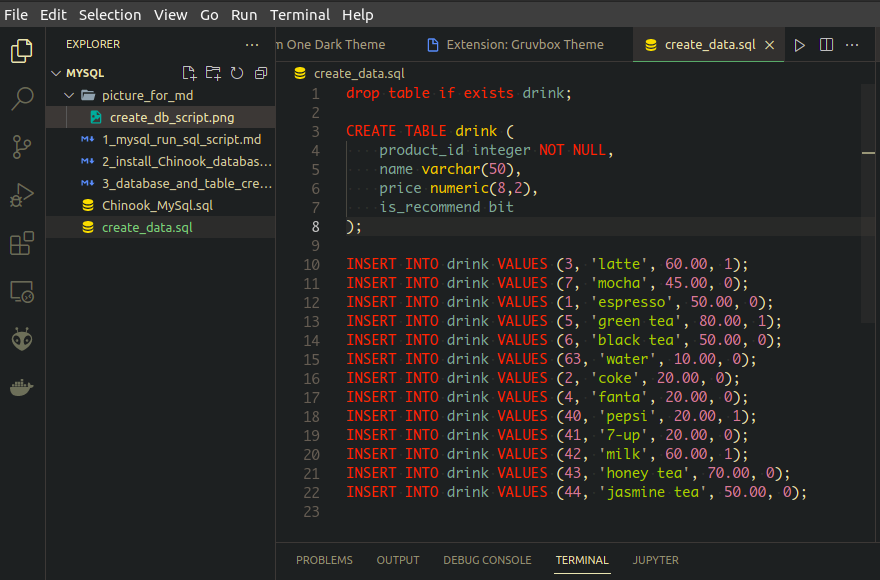

<!-- # 1. run sql script
## 1.1. sql
* ### 1.1.1. 
    * ### 1.1.1.1.
        ```
        ```
* ### 1.1.2.
## 1.2. sqlsh -->

# 1. run sql script
### 1.1. sql
* open terminal พิมพ์
    ```
    $ mysql -u root -p
    ```
* ใส่ password เข้าสู่ mysql และ create bakery database
    ```
    mysql>
    mysql> show databases; 
    mysql> create database bakery; 
    mysql> use bakery;
    mysql> create table menu(id int, descr varchar(50), price int);
    mysql> insert into menu values (1, 'marble', 90), (2, 'muffin', 60);
    mysql> select * from menu;
    mysql> show tables;

    ```
* create database script
    

* run script by mysql
    ```
    mysql> \. create_data.sql
    ```
    * แสดงค่า ตารางที่ถูก Add เข้าไป
        ```
        mysql> show tables;
        ```
    * ลบ table drink ออกจาก bakery database เพื่อเตรียมทดลอง runscript อีกแบบ
        ```
        mysql> drop table drink;
        mysql> \q
        ```
    * ทำการ Run Script โดยการเพิ่ม Tables ลงใน bakery database เลยโดยที่ไม่ต้องเข้าไปใน shell
        ```
        $ mysql -u root -p -D bakery < create_data.sql 
        Enter password: 
        $
        ```
    * เข้าไปตรวจสอบ Table ที่ Add เข้าไป
        ```
        $ mysql -u root -p -D bakery
        ```
        ```
        mysql> show tables;
        ```

### 1.2. sqlsh
* 
```
$ mysqlsh root@localhost/bakery -f create_data.sql
```

```
$  mysqlsh root@localhost/bakery
```
```
> 
> \sql
> \. create_data.sql
> show tables;
> select * from drink;
> \q
```
